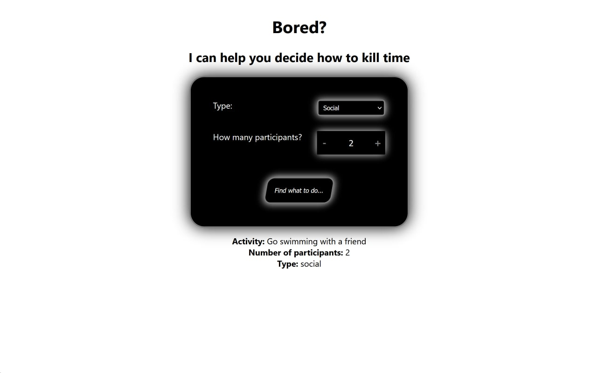

# Bored-api fetch React JS app

That is my ***pet project*** that fetches bored-api: **boredapi.com**. 

## Preview: 

## **[Ссылка на проект](https://daniilboyarinkov.github.io/bored-api-fetch-react/)**

In the latest version **Theme Toggle button** was added in the top right corner. 

---

What have I used while making that poject?
1. React functional components
2. React hooks 
3. Fetching API
4. CSS variables
5. Media queries

> I'm just learning
